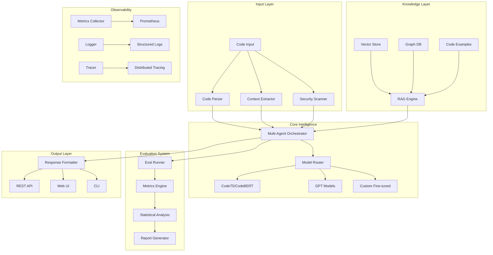
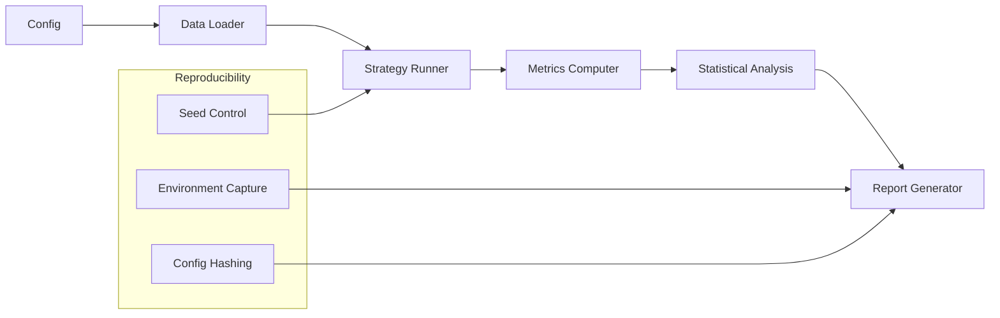
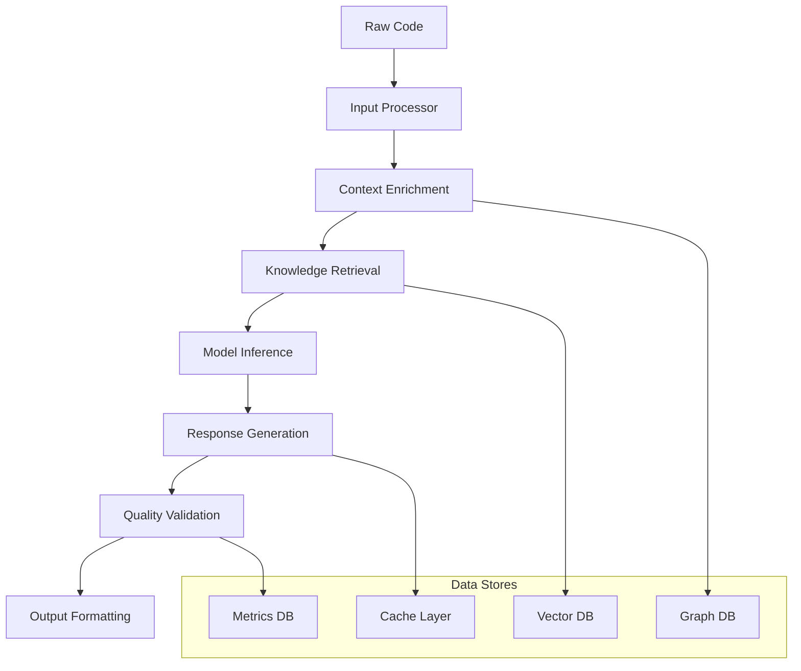
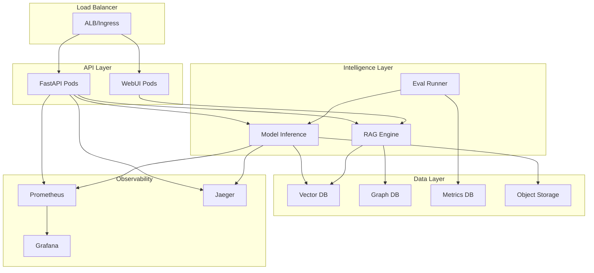
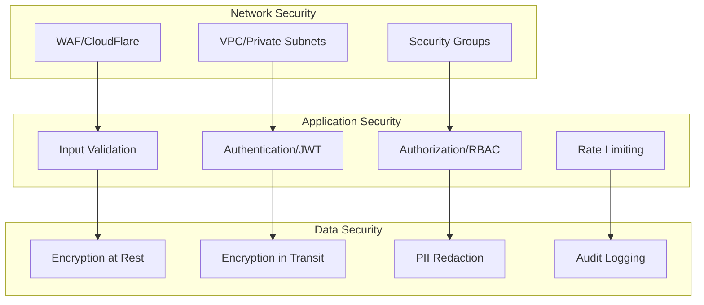

# 🏗️ Architecture: Code Explainer System Design

## 🎯 Vision Statement

**Target Architecture**: A research-validated, production-ready code explanation system with built-in evaluation, reproducible experiments, and seamless data/metrics lineage.

## 📋 System Overview



## 🔧 Component Architecture

### Core Modules

#### 1. **Input Processing (`src/input/`)**
```python
# Unified input handling with validation and preprocessing
class InputProcessor:
    def parse_code(self, code: str) -> ParsedCode
    def extract_context(self, code: str) -> Context
    def scan_security(self, code: str) -> SecurityReport
```

**Responsibilities**:
- Code parsing and AST generation
- Context extraction (imports, dependencies, patterns)
- Security scanning (PII, credentials, vulnerabilities)
- Input validation and sanitization

**Design Principles**:
- Immutable input objects
- Fail-fast validation
- Comprehensive error reporting
- Plugin architecture for custom parsers

#### 2. **Intelligence Engine (`src/intelligence/`)**
```python
# Multi-agent orchestration with strategy selection
class IntelligenceEngine:
    def explain(self, parsed_code: ParsedCode, context: Context) -> Explanation
    def select_strategy(self, code_type: CodeType) -> Strategy
    def route_model(self, strategy: Strategy, complexity: int) -> Model
```

**Responsibilities**:
- Multi-agent coordination and strategy selection
- Model routing based on code complexity and type
- Response synthesis and quality validation
- Fallback and error handling

**Design Principles**:
- Strategy pattern for explanation approaches
- Circuit breaker for model failures
- Response caching with TTL
- A/B testing infrastructure

#### 3. **Knowledge System (`src/knowledge/`)**
```python
# RAG engine with hybrid search and reranking
class KnowledgeEngine:
    def retrieve(self, query: str, k: int = 10) -> List[Document]
    def rerank(self, query: str, docs: List[Document]) -> List[Document]
    def embed(self, text: str) -> np.ndarray
```

**Responsibilities**:
- Vector embeddings and similarity search
- Hybrid retrieval (dense + sparse)
- Cross-encoder reranking
- Knowledge graph traversal

**Design Principles**:
- Pluggable embedding models
- Incremental index updates
- Query optimization and caching
- Relevance feedback learning

### Evaluation Framework

#### 4. **Evaluation System (`evals/`)**
```python
# Unified evaluation with reproducible experiments
class EvalRunner:
    def run_evaluation(self, config: EvalConfig) -> EvalResults
    def compare_strategies(self, strategies: List[str]) -> ComparisonReport
    def ablation_study(self, components: List[str]) -> AblationResults
```

**Architecture**:


**Key Features**:
- **Deterministic Runs**: Seed control across all random components
- **Config Management**: YAML-based configurations with validation
- **Metrics Pipeline**: Standardized accuracy, retrieval, latency, cost metrics
- **Statistical Rigor**: Confidence intervals, significance testing, effect sizes
- **Provenance Tracking**: Full lineage from config to results

#### 5. **Metrics & Observability (`src/observability/`)**
```python
# Comprehensive monitoring with real-time dashboards
class MetricsCollector:
    def track_request(self, endpoint: str, latency: float, status: int)
    def track_model_performance(self, model: str, accuracy: float, cost: float)
    def track_user_satisfaction(self, rating: int, feedback: str)
```

**Observability Stack**:
- **Metrics**: Prometheus + Grafana dashboards
- **Logging**: Structured JSON logs with correlation IDs
- **Tracing**: OpenTelemetry distributed tracing
- **Alerting**: PagerDuty integration for critical issues

## 🗄️ Data Architecture

### Data Flow Pipeline



### Storage Systems

#### Vector Store (FAISS + PostgreSQL)
- **Embeddings**: Code snippets, documentation, examples
- **Indexing**: HNSW for fast approximate search
- **Metadata**: Source, timestamp, quality scores
- **Sharding**: Horizontal scaling by code domain

#### Graph Database (Neo4j)
- **Code Relationships**: Function calls, inheritance, dependencies
- **Knowledge Graph**: Concepts, patterns, best practices
- **User Interactions**: Query history, feedback, preferences
- **Provenance**: Data lineage and transformation tracking

#### Metrics Database (ClickHouse)
- **Performance Metrics**: Latency, throughput, error rates
- **Quality Metrics**: Accuracy, relevance, user satisfaction
- **Usage Analytics**: Popular queries, model selection, trends
- **A/B Testing**: Experiment results and statistical analysis

### Data Lineage & Provenance

```yaml
# Example run manifest
run_id: "eval_20250907_143022"
config_hash: "sha256:a1b2c3d4..."
git_commit: "main@7f8e9d2"
environment:
  python_version: "3.11.5"
  torch_version: "2.0.1"
  transformers_version: "4.33.2"
data:
  train_dataset: "code_explanations_v2.1"
  eval_dataset: "holdout_test_500"
model:
  name: "codet5-small-finetuned"
  checkpoint: "checkpoint-1000"
results:
  accuracy: 0.847
  bleu_score: 0.623
  latency_p95: 450.2
```

## 🔧 Configuration Management

### Hierarchical Configuration

```yaml
# configs/base.yaml
model:
  name: "codet5-base"
  max_length: 512
  temperature: 0.1

retrieval:
  top_k: 10
  similarity_threshold: 0.7
  rerank: true

evaluation:
  metrics: ["accuracy", "bleu", "rouge", "latency"]
  bootstrap_samples: 1000
  confidence_level: 0.95

# configs/experiments/ablation_retrieval.yaml
extends: "base.yaml"
name: "Retrieval Ablation Study"
matrix:
  retrieval.top_k: [5, 10, 20, 50]
  retrieval.rerank: [true, false]
  retrieval.similarity_threshold: [0.6, 0.7, 0.8]
```

### Configuration Features

- **Schema Validation**: Pydantic models with type checking
- **Environment Overrides**: Environment variables for secrets
- **Matrix Experiments**: Automatic parameter grid generation
- **Config Inheritance**: Base configs with experiment-specific overrides
- **Version Control**: Config versioning with backward compatibility

## 🚀 Deployment Architecture

### Cloud-Native Design



### Infrastructure as Code

```terraform
# infrastructure/aws/main.tf
module "eks_cluster" {
  source = "./modules/eks"
  
  cluster_name = "code-explainer"
  node_groups = {
    inference = {
      instance_types = ["g5.xlarge"]
      scaling_config = {
        desired_size = 2
        max_size     = 10
        min_size     = 1
      }
    }
    general = {
      instance_types = ["t3.large"]
      scaling_config = {
        desired_size = 3
        max_size     = 20
        min_size     = 2
      }
    }
  }
}
```

### Container Strategy

```dockerfile
# Dockerfile.inference
FROM nvidia/cuda:11.8-runtime-ubuntu20.04
RUN pip install torch transformers accelerate
COPY src/ /app/src/
CMD ["uvicorn", "src.api.main:app", "--host", "0.0.0.0"]

# Dockerfile.eval
FROM python:3.11-slim
RUN pip install pandas scikit-learn
COPY evals/ /app/evals/
CMD ["python", "-m", "evals.runner"]
```

## 🔐 Security Architecture

### Multi-Layer Security



### Security Controls

- **Input Sanitization**: Code injection prevention, malicious input detection
- **Access Control**: JWT authentication, role-based permissions
- **Data Protection**: Automatic PII redaction, encrypted storage
- **Audit Trail**: Complete request logging, security event monitoring
- **Compliance**: GDPR data handling, SOC2 controls

## 📊 Performance & Scalability

### Performance Targets

| Component | Latency Target | Throughput Target | Availability |
|-----------|----------------|-------------------|--------------|
| API Endpoint | <500ms P95 | 1000 RPS | 99.9% |
| Model Inference | <2s P95 | 100 concurrent | 99.5% |
| RAG Retrieval | <100ms P95 | 500 RPS | 99.9% |
| Evaluation Suite | <10min full | 1 concurrent | 99% |

### Scaling Strategies

- **Horizontal Scaling**: Kubernetes HPA based on CPU/memory/custom metrics
- **Caching**: Multi-layer caching (Redis, CDN, model inference cache)
- **Model Optimization**: ONNX conversion, quantization, batching
- **Database Optimization**: Read replicas, connection pooling, query optimization

## 🧪 Quality Assurance

### Testing Strategy

```python
# tests/integration/test_end_to_end.py
def test_code_explanation_pipeline():
    """Test complete pipeline from code input to explanation output."""
    code = "def fibonacci(n): return n if n <= 1 else fibonacci(n-1) + fibonacci(n-2)"
    
    response = client.post("/explain", json={"code": code, "strategy": "enhanced_rag"})
    
    assert response.status_code == 200
    assert response.json()["explanation"]
    assert response.json()["confidence"] > 0.8
    assert response.json()["latency"] < 2.0
```

### Quality Gates

- **Unit Tests**: >90% coverage for core modules
- **Integration Tests**: End-to-end workflow validation
- **Performance Tests**: Load testing with realistic workloads
- **Security Tests**: SAST/DAST scanning, dependency vulnerability checks
- **Evaluation Tests**: Model accuracy regression testing

---

**Architecture Version**: 2.0  
**Last Updated**: September 7, 2025  
**Next Review**: September 21, 2025
