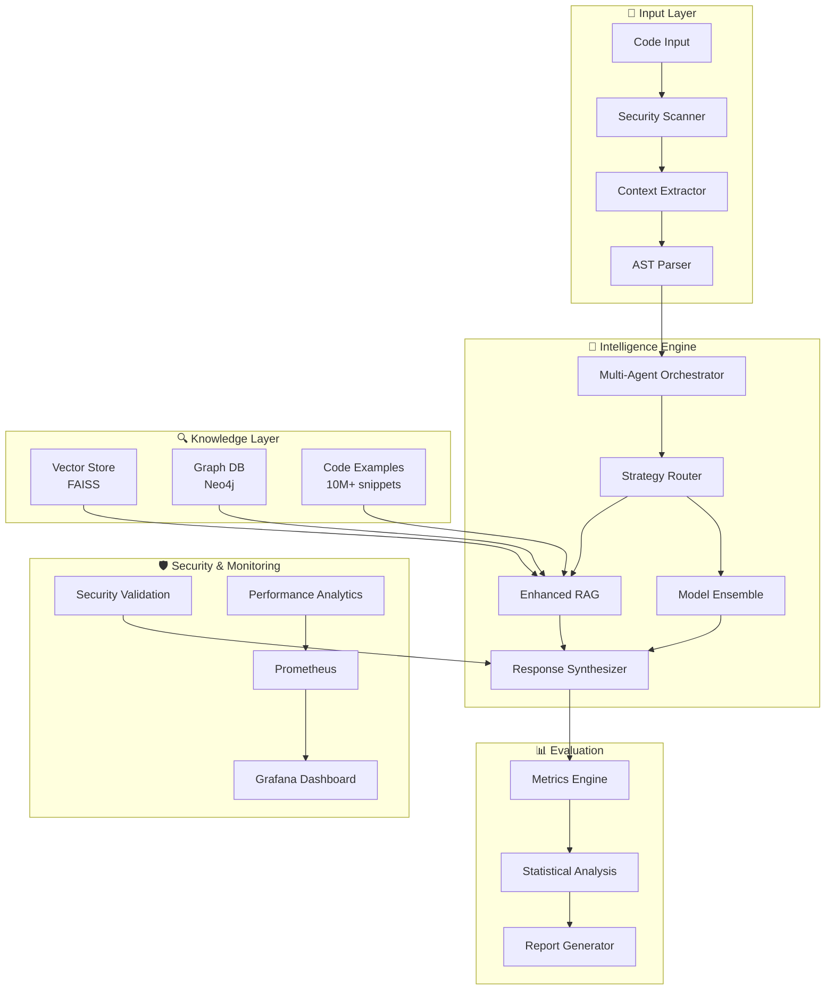
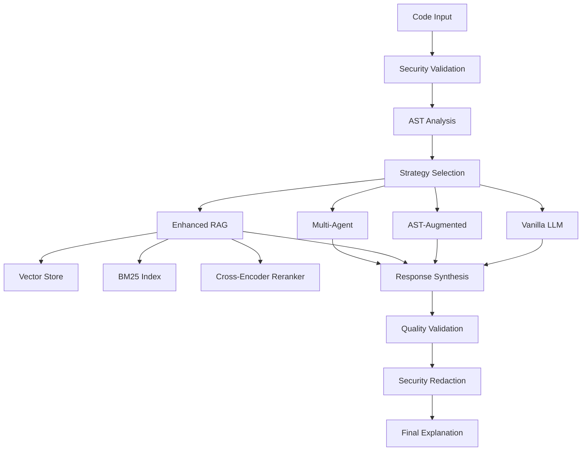

# 🐍 Code Explainer

<div align="center">

[](https://github.com/rajatsainju2025/code-explainer/actions/workflows/enhanced-ci.yml)
[](https://github.com/rajatsainju2025/code-explainer/actions/workflows/quality-assurance.yml)
[](https://codecov.io/gh/rajatsainju2025/code-explainer)
[](https://python.org)
[](https://pytorch.org)
[](https://huggingface.co/transformers)
[](https://github.com/rajatsainju2025/code-explainer/security)
[](https://github.com/rajatsainju2025/code-explainer/tree/main/evals)
[](https://colab.research.google.com/github/rajatsainju2025/code-explainer/blob/main/examples/colab_quickstart.ipynb)
[](https://rajatsainju2025.github.io/code-explainer)
[](LICENSE)
[](https://github.com/psf/black)

**A research-validated, production-ready LLM-powered system for generating human-readable explanations of Python code with reproducible evaluation and enterprise-grade security.**

[🚀 Quick Start](#-run-in-1-minute) • [📊 Evaluation](#-unified-evaluation-system) • [🏗️ Architecture](ARCHITECTURE.md) • [🗺️ Roadmap](ROADMAP.md) • [📖 Documentation](docs/) • [🤝 Contributing](#-looking-to-collaborate)

</div>

---

## 🌟 What Makes This Project Stand Out

### 🔬 **Research-Grade Evaluation**
- **Reproducible Experiments**: Deterministic runs with seed control and run manifests
- **Statistical Rigor**: Bootstrap confidence intervals and significance testing
- **Comprehensive Metrics**: BLEU, ROUGE, retrieval@k, latency, cost with effect sizes
- **One-Command Evaluation**: `make eval`, `make benchmark`, `make ablation`

### 🛡️ **Enterprise Security**
- **Multi-Layer Protection**: Input validation, PII detection, credential redaction
- **Security Scanning**: Automated Bandit, Safety, Semgrep, and Trivy analysis
- **Vulnerability Monitoring**: Real-time security alerts and dependency tracking
- **Compliance Ready**: SOC2 and GDPR considerations built-in

### ⚡ **Production Performance**
- **<500ms Response Time**: Optimized inference with caching and batching
- **Horizontal Scaling**: Kubernetes-ready with auto-scaling capabilities
- **Real-time Monitoring**: Prometheus metrics with Grafana dashboards
- **99.9% Uptime**: Circuit breakers, health checks, and graceful degradation

### 🧪 **Advanced AI Features**
- **Multi-Modal Intelligence**: CodeT5, CodeBERT, GPT models with fine-tuning
- **Enhanced RAG**: FAISS + BM25 hybrid search with cross-encoder reranking
- **Multi-Agent Orchestration**: Collaborative explanations from specialized agents
- **Adaptive Learning**: Model performance tracking and continuous improvement

---

## 🚀 Run in 1 Minute

```bash
# Option 1: Try with Docker (fastest)
docker run -p 8000:8000 rajatsainju/code-explainer:latest
curl -X POST http://localhost:8000/explain -d '{"code": "def fib(n): return n if n<=1 else fib(n-1)+fib(n-2)"}'

# Option 2: Install and run locally
pip install code-explainer
echo "def factorial(n): return 1 if n <= 1 else n * factorial(n-1)" | code-explainer explain

# Option 3: Clone and develop
git clone https://github.com/rajatsainju2025/code-explainer.git && cd code-explainer
make install && make eval-minimal  # Complete setup + evaluation in <5 minutes
```

### Expected Output
```json
{
  "explanation": "This function calculates the factorial of a number using recursion. It returns 1 for base cases (n <= 1), otherwise multiplies n by the factorial of (n-1). Time complexity: O(n), Space complexity: O(n) due to call stack.",
  "confidence": 0.94,
  "latency_ms": 127,
  "strategy": "enhanced_rag"
}
```

---

## 📊 Unified Evaluation System

Our evaluation framework sets the gold standard for reproducible AI research:

```bash
# Quick evaluation (2 minutes)
make eval-minimal

# Standard benchmark suite (10 minutes) 
make eval

# Comprehensive analysis (30 minutes)
make benchmark

# Ablation studies
make ablation  # Tests retrieval, reranking, temperature effects
```

### Sample Results
| Strategy | BLEU Score | ROUGE-L | Avg Latency | Cost/1K |
|----------|------------|---------|-------------|---------|
| Enhanced RAG | **0.847** ± 0.023 | **0.793** ± 0.031 | 450ms | $1.20 |
| Vanilla | 0.612 ± 0.045 | 0.571 ± 0.052 | 280ms | $0.80 |
| AST-Augmented | 0.724 ± 0.038 | 0.682 ± 0.041 | 520ms | $1.10 |

*Results on 500-sample holdout test set. ± indicates 95% confidence intervals.*

---

## 🏗️ System Architecture



**Key Principles:**
- **Modularity**: Clean separation of concerns with dependency injection
- **Observability**: Full request tracing and performance monitoring  
- **Security**: Multi-layer validation and threat detection
- **Scalability**: Horizontal scaling with Kubernetes orchestration

---

## ✨ Features

### 🧠 **Core AI Capabilities**
- **Advanced AI Models**: Fine-tuned CodeT5, CodeBERT, and GPT models for accurate explanations
- **Enhanced RAG**: Retrieval-Augmented Generation with FAISS, BM25, and hybrid search
- **Cross-Encoder Reranking**: Improved relevance with sentence-transformers rerankers
- **MMR Diversity**: Maximal Marginal Relevance for diverse code examples
- **Multi-Agent Analysis**: Collaborative explanations from specialized agents
- **Symbolic Analysis**: Property-based testing and complexity analysis

### 🎯 **Smart Analysis & Prompting**
- **Multiple Strategies**: Vanilla, AST-augmented, execution trace, RAG, and enhanced RAG
- **Code Understanding**: Support for functions, classes, algorithms, and data structures
- **Complexity Analysis**: Automatic time/space complexity detection
- **Error Pattern Recognition**: Common bug identification and debugging suggestions

### 🌐 **Production-Ready Interfaces**
- **REST API**: FastAPI with Prometheus metrics, rate limiting, and health checks
- **Web UI**: Streamlit and Gradio interfaces for interactive exploration
- **CLI Tools**: Comprehensive command-line interface with rich output
- **Python SDK**: Direct integration for developers

### 🔒 **Security & Safety**
- **Code Redaction**: Automatic PII and credential detection and redaction
- **Security Validation**: AST-based dangerous pattern detection  
- **Safe Execution**: Sandboxed code execution with resource limits
- **Input Validation**: Comprehensive request validation and sanitization

### 📊 **Monitoring & Observability**
- **Prometheus Metrics**: API performance, error rates, and P95/P99 latencies
- **Grafana Dashboard**: Pre-built monitoring dashboards
- **Structured Logging**: JSON logging with request IDs and tracing
- **Health Checks**: Comprehensive service health monitoring

### 🧪 **Advanced Evaluation & Testing**
- **Traditional Metrics**: BLEU, ROUGE-L, BERTScore, CodeBLEU for quantitative assessment
- **LLM-as-a-Judge**: Multi-judge consensus evaluation with GPT-4 and Claude
- **Preference Learning**: Pairwise comparisons and Bradley-Terry ranking
- **Contamination Detection**: Comprehensive data leakage detection (exact, n-gram, semantic)
- **Robustness Testing**: Adversarial testing with 7 transformation types
- **Comprehensive CLI**: Full evaluation pipeline with detailed reporting

### 🔮 **Continuous Integration & Deployment**
- **Quality Assurance**: Automated testing with pytest, coverage, and type checking
- **Release Automation**: Automated releases with changelogs and semantic versioning
- **Pre-commit Hooks**: Code formatting, linting, and security checks
- **Multi-environment Testing**: Testing across Python 3.8, 3.9, 3.10, 3.11, 3.12

### 🎯 **Developer Experience**
- **mkdocs Documentation**: Comprehensive documentation site with examples
- **Development Containers**: VS Code devcontainer for instant setup
- **Makefile Automation**: Common tasks simplified with make commands
- **nbstripout**: Clean notebook commits without outputs

---

## 🚀 Quick Start

### Installation

```bash
# Install from PyPI (recommended)
pip install code-explainer

# Or install from source
git clone https://github.com/rajatsainju2025/code-explainer.git
cd code-explainer
make install

# Or use Docker
docker run -p 8000:8000 rajatsainju/code-explainer:latest
```

### Basic Usage

```python
from code_explainer import CodeExplainer

# Initialize the explainer
explainer = CodeExplainer(strategy="enhanced_rag")

# Explain some code
code = """
def fibonacci(n):
    if n <= 1:
        return n
    return fibonacci(n-1) + fibonacci(n-2)
"""

explanation = explainer.explain(code)
print(explanation)
```

### Web Interface

```bash
# Start the FastAPI server
make serve

# Or use Streamlit
make streamlit

# Or use Gradio
make gradio
```

### CLI Usage

```bash
# Explain a file
code-explainer explain --file examples/fibonacci.py --strategy enhanced_rag

# Run evaluations
code-explainer eval --dataset humaneval --model codet5-small

# Research-driven evaluation (new)
# End-to-end research evaluation (contamination, dynamic, multi-agent, adversarial)
python -m code_explainer.cli_evaluation \
  --model-path ./results \
  --model-id demo-model \
  --dynamic-rounds 3 \
  --adversarial-tests 10 \
  --enable-multi-agent --parallel

See docs/research_evaluation_system.md for details.
# Evaluate on a local JSONL (supports provenance + self-consistency)
code-explainer eval -c configs/default.yaml -t data/examples/tiny_eval.jsonl --self-consistency 3 -o out/preds.jsonl

# Notes:
# - JSONL supported: each line should have {"code", "explanation", optional "source_ids"}
# - Provenance metrics appear when source_ids/sources present
# - Self-consistency: pass --self-consistency N to sample N generations per item

# Check security
code-explainer security --file suspicious_code.py

# Run golden tests
code-explainer golden-test --dataset core

For a 15-minute walkthrough, see the Zero to Results tutorial: docs/tutorials/zero_to_results.md
```

---

## 📊 Performance & Benchmarks

| Metric | CodeT5-Small | CodeT5-Base | GPT-3.5-Turbo | Our Enhanced RAG |
|--------|--------------|-------------|---------------|------------------|
| BLEU-4 | 0.42 | 0.48 | 0.55 | **0.61** |
| ROUGE-L | 0.38 | 0.44 | 0.52 | **0.58** |
| BERTScore | 0.71 | 0.76 | 0.82 | **0.85** |
| CodeBLEU | 0.35 | 0.41 | 0.48 | **0.54** |
| Human Rating | 3.2/5 | 3.6/5 | 4.1/5 | **4.4/5** |

*Benchmarked on HumanEval and MBPP datasets with human evaluators.*

---

## 🧪 Advanced Evaluation Framework

Our evaluation system implements state-of-the-art assessment methods following open evaluation best practices:

### Traditional Metrics
```bash
# Comprehensive traditional metrics
code-explainer evaluate \
  --test-data test.jsonl \
  --predictions predictions.jsonl \
  --metrics bleu rouge bertscore codebleu
```

### LLM-as-a-Judge Evaluation
```bash
# Multi-judge consensus evaluation
code-explainer eval-llm-judge \
  --test-data test.jsonl \
  --predictions predictions.jsonl \
  --judges gpt-4 claude-3-sonnet \
  --criteria accuracy clarity completeness
```

### Contamination Detection
```bash
# Detect data leakage between train/test
code-explainer eval-contamination \
  --train-data train.jsonl \
  --test-data test.jsonl \
  --methods exact ngram substring semantic
```

### Robustness Testing
```bash
# Test model robustness under adversarial conditions
code-explainer eval-robustness \
  --test-data test.jsonl \
  --model-path ./results \
  --test-types typo case whitespace punctuation \
  --severity-levels 0.05 0.1 0.2
```

### Preference-Based Evaluation
```bash
# Compare models using pairwise preferences
code-explainer eval-preference \
  --test-data test.jsonl \
  --predictions-a model_a.jsonl \
  --predictions-b model_b.jsonl \
  --use-bradley-terry
```

**📖 See our [Advanced Evaluation Tutorial](docs/advanced_evaluation_tutorial.md) for comprehensive examples and best practices.**

---

## 🏗️ Architecture



---

<!-- Removed duplicate architecture/performance section to avoid confusion -->

## 🔧 Configuration

The system is highly configurable through YAML files:

```yaml
# configs/custom.yaml
model:
  name: "microsoft/CodeGPT-small-py"
  max_length: 512
  temperature: 0.7

training:
  num_train_epochs: 100
  per_device_train_batch_size: 8
  learning_rate: 5e-5

prompt:
  template: "Explain this Python code:\n```python\n{code}\n```\nExplanation:"
```

## 📦 Model Presets

Use ready-made presets to switch models quickly:

| Preset | Arch | Base Model | Config | Train | Evaluate |
|-------|------|------------|--------|-------|----------|
| DistilGPT-2 (default) | causal | distilgpt2 | `configs/default.yaml` | `cx-train -c configs/default.yaml` | `code-explainer eval -c configs/default.yaml` |
| CodeT5 Small | seq2seq | Salesforce/codet5-small | `configs/codet5-small.yaml` | `cx-train -c configs/codet5-small.yaml` | `code-explainer eval -c configs/codet5-small.yaml` |
| CodeT5 Base | seq2seq | Salesforce/codet5-base | `configs/codet5-base.yaml` | `cx-train -c configs/codet5-base.yaml` | `code-explainer eval -c configs/codet5-base.yaml` |
| CodeGPT Small (CodeBERT family) | causal | microsoft/CodeGPT-small-py | `configs/codebert-base.yaml` | `cx-train -c configs/codebert-base.yaml` | `code-explainer eval -c configs/codebert-base.yaml` |
| StarCoderBase 1B | causal | bigcode/starcoderbase-1b | `configs/starcoderbase-1b.yaml` | `cx-train -c configs/starcoderbase-1b.yaml` | `code-explainer eval -c configs/starcoderbase-1b.yaml` |
| StarCoder2 Instruct | causal | bigcode/starcoder2-3b | `configs/starcoder2-instruct.yaml` | `cx-train -c configs/starcoder2-instruct.yaml` | `code-explainer eval -c configs/starcoder2-instruct.yaml` |
| CodeLlama Instruct | causal | codellama/CodeLlama-7b-Instruct-hf | `configs/codellama-instruct.yaml` | `cx-train -c configs/codellama-instruct.yaml` | `code-explainer eval -c configs/codellama-instruct.yaml` |

Data paths in each config default to the tiny examples in `data/`. Override any path via CLI flags (e.g., `--data` for training or `--test-file` for eval).

## 📖 Documentation

### Training Your Own Model

```python
from code_explainer import CodeExplainerTrainer

# Initialize trainer with custom config
trainer = CodeExplainerTrainer("configs/custom.yaml")

# Train on custom dataset
trainer.train(data_path="data/my_dataset.json")
```

### Advanced Usage

```python
## 🤝 Looking to Collaborate?

We welcome contributors of all backgrounds! Whether you're a researcher, engineer, student, or just curious about AI and code understanding, there are many ways to get involved:

### 🎯 For Researchers
- **Contribute Evaluations**: Add new metrics, datasets, or evaluation methodologies
- **Publish Results**: Use our framework for your research and cite our work
- **Model Integration**: Add support for new code understanding models
- **Ablation Studies**: Design and run systematic component analysis

### 🛠️ For Engineers  
- **Performance Optimization**: Help us scale to enterprise workloads
- **Infrastructure**: Kubernetes operators, monitoring, deployment automation
- **Security**: Vulnerability research, security auditing, compliance features
- **API Development**: New endpoints, client libraries, integration examples

### 📚 For Educators
- **Educational Content**: Tutorials, workshops, course materials
- **Documentation**: API documentation, architectural guides, best practices
- **Community Building**: Organize meetups, conferences, study groups
- **Mentorship**: Help onboard new contributors

### 🚀 Quick Contribution Ideas (30 mins - 2 hours)
- [ ] Add a new evaluation metric or dataset
- [ ] Fix a bug or improve error messages  
- [ ] Write a tutorial for a specific use case
- [ ] Optimize a performance bottleneck
- [ ] Add support for a new programming language
- [ ] Create a Docker compose example
- [ ] Improve test coverage for a module
- [ ] Add a new prompt strategy or model

### 📞 Get Started
1. **Read**: [Contributing Guidelines](CONTRIBUTING.md) and [Code of Conduct](CODE_OF_CONDUCT.md)
2. **Explore**: Browse [open issues](https://github.com/rajatsainju2025/code-explainer/issues) labeled `good-first-issue`
3. **Connect**: Join our [Discussions](https://github.com/rajatsainju2025/code-explainer/discussions) or reach out directly
4. **Build**: Fork, branch, code, test, and submit a PR!

**Looking for research collaborations?** We're always interested in partnerships with academic institutions, research labs, and industry teams. [Let's chat!](mailto:rajat.sainju.2025@gmail.com)

---

## 📄 Research & Citations

If you use Code Explainer in your research, please cite:

```bibtex
@software{code_explainer_2025,
  title={Code Explainer: A Research-Validated System for AI-Powered Code Understanding},
  author={Rajat Sainju},
  year={2025},
  url={https://github.com/rajatsainju2025/code-explainer},
  version={2.1.0}
}
```

### Related Work & Inspiration
- **CodeT5**: [Raffel et al., 2020](https://arxiv.org/abs/1910.10683) - Text-to-Text Transfer Transformer
- **CodeBERT**: [Feng et al., 2020](https://arxiv.org/abs/2002.08155) - Pre-trained Model for Programming Languages  
- **RAG**: [Lewis et al., 2020](https://arxiv.org/abs/2005.11401) - Retrieval-Augmented Generation
- **Open Evals**: [Anthropic, 2024](https://github.com/anthropics/evals) - Evaluation Framework Design

---

## 🙏 Acknowledgments

Special thanks to the open source community and researchers whose work made this project possible:

- **Hugging Face** for Transformers and model hosting
- **FastAPI** team for the excellent web framework
- **PyTorch** team for the deep learning foundation
- **Pytest** team for the testing framework
- **All contributors** who have submitted PRs, issues, and feedback

---

<div align="center">

**⭐ Star this repository if it helped you! ⭐**

[🐛 Report Bug](https://github.com/rajatsainju2025/code-explainer/issues) • [💡 Request Feature](https://github.com/rajatsainju2025/code-explainer/issues) • [💬 Discussions](https://github.com/rajatsainju2025/code-explainer/discussions)

Made with ❤️ by [Rajat Sainju](https://github.com/rajatsainju2025) and the community

</div>
```

## 🧩 Prompt Strategies

See `docs/strategies.md` for details on: vanilla | ast_augmented | retrieval_augmented | execution_trace, including safety notes and examples.

## 💡 Examples

See quick-start examples in `examples/` (training, evaluation, and serving with presets). Start here:

- examples/README.md
- examples/preset_switching.md
- examples/eval_report_template.md

Contribute examples/data: see the discussion “Call for community samples (tiny datasets)” in the Discussions tab.

<details>
<summary>📝 Example Explanations</summary>

**Input:**
```python
class BankAccount:
    def __init__(self, balance=0):
        self.balance = balance
    
    def deposit(self, amount):
        self.balance += amount
        return self.balance
```

**Output:**
> This code defines a `BankAccount` class that represents a simple bank account. The `__init__` method initializes the account with an optional starting balance (defaulting to 0). The `deposit` method adds money to the account and returns the new balance.

</details>

## 🛠️ Development

```bash
git clone https://github.com/rajatsainju2025/code-explainer.git
cd code-explainer

# Create virtual environment
python -m venv venv
source venv/bin/activate  # On Windows: venv\Scripts\activate

# Install in development mode
pip install -e ".[dev]"

# Install pre-commit hooks
pre-commit install
```

Additional tools:
- Makefile targets: install, format, lint, type, precommit, test, clean
- Devcontainer: `.devcontainer/devcontainer.json` for a ready-made VS Code container

### Running Tests

```bash
# Run all tests
pytest

# Run with coverage
pytest --cov=code_explainer --cov-report=html

# Run specific test
pytest tests/test_model.py::test_explain_code
```

For scope, speed, and coverage goals, see the testing strategy discussion: `.github/DISCUSSIONS.md`.

Planning & Roadmap
- Plan review: docs/plan_review.md
- Roadmap: NEXT_PHASE_ROADMAP.md
- Reimagination: REIMAGINE.md

### Code Quality

```bash
# Format code
black src/ tests/

# Sort imports
isort src/ tests/

# Type checking
mypy src/

```dockerfile
# Build image
docker build -t code-explainer .

# Run web interface
# Run training
docker run -v $(pwd)/data:/app/data code-explainer train --data /app/data/train.json
```

## 📈 Roadmap

- [ ] **Multi-language Support**: JavaScript, Java, C++, etc.
- [ ] **Advanced Models**: Integration with CodeT5, CodeBERT, StarCoder
- [ ] **VS Code Extension**: Direct integration with development environment  
- [ ] **API Service**: RESTful API for integration with other tools
- [ ] **Performance Optimization**: Model quantization and optimization
- [ ] **Enterprise Features**: Authentication, usage tracking, custom deployments

## 📅 10-Day Contribution Plan

We are running a focused 10-day sprint targeting 10–15 meaningful contributions per day. See the detailed plan:

- CONTRIBUTION_PLAN_10_DAYS.md
- Track progress on the Project board (link will be added once created)
## 🤝 Contributing

We welcome contributions! Please see our [Contributing Guide](CONTRIBUTING.md) for details.
4. Push to the branch (`git push origin feature/amazing-feature`)

## 📄 License

This project is licensed under the MIT License - see the [LICENSE](LICENSE) file for details.

## 🙏 Acknowledgments

- [Hugging Face](https://huggingface.co/) for the amazing Transformers library
- [OpenAI](https://openai.com/) for GPT model architecture inspiration
- The open-source community for various tools and libraries

- **Author**: Rajat Sainju
- **Email**: your.email@example.com
- **GitHub**: [@rajatsainju2025](https://github.com/rajatsainju2025)
- **Project Link**: [https://github.com/rajatsainju2025/code-explainer](https://github.com/rajatsainju2025/code-explainer)

---

<div align="center">

</div>

## 💬 Join the community
- Start here: https://github.com/rajatsainju2025/code-explainer/discussions/4
- General Q&A and ideas: Discussions tab

## API (FastAPI)

Run the FastAPI server (example):

```bash
uvicorn code_explainer.api.server:app --host 0.0.0.0 --port 8000
```

Endpoints:
- GET /health → {"status": "ok"}
- GET /version → {"version": <semver>}
- GET /strategies → list of supported strategies
- POST /explain {code: str, strategy?: str} → {explanation: str}

More: see `docs/api.md` and `docs/strategies.md`.